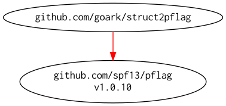

# [struct2pflag]

<!-- badges.cmd |-->
[](https://github.com/goark/struct2pflag/actions)
[](https://raw.githubusercontent.com/goark/struct2pflag/master/LICENSE)
[](https://github.com/goark/mt/releases/latest)
<!-- -->

`struct2flag` automatically registers struct fields as flags for your Go command-line programs.

(forked from [hymkor/struct2flag](https://github.com/hymkor/struct2flag))

Minimal example
---------------

`example.go`

```examples/example.go
package main

import (
	"fmt"

	"github.com/goark/struct2pflag"
	"github.com/spf13/pflag"
)

type Env struct {
	B bool   `pflag:"boolean,b,This is a boolean flag"`
	N int    `pflag:"integer,n,This is an integer flag"`
	S string `pflag:"string,s,this is a string flag"`
}

func (e Env) Run() {
	fmt.Printf("B=%#v\n", e.B)
	fmt.Printf("N=%#v\n", e.N)
	fmt.Printf("S=%#v\n", e.S)
}

func main() {
	var env Env
	struct2pflag.BindDefault(&env)
	pflag.Parse()
	env.Run()
}
```

`go run examples/example.go -h`

```go run examples/example.go -h |
Usage of /home/username/.cache/go-build/da/da816f0e7f8408541782f4f492c77975deac083e65218c1b2bdcf93706b81aa7-d/example:
  -b, --boolean         This is a boolean flag
  -n, --integer int     This is an integer flag
  -s, --string string   this is a string flag
```

`go run examples/example.go -b -n 1 -s foo`

```go run examples/example.go -b -n 1 -s foo |
B=true
N=1
S="foo"
```

`go run examples/example.go --boolean --integer 1 --string foo`

```go run examples/example.go -b -n 1 -s foo |
B=true
N=1
S="foo"
```

Reading default values from JSON and overriding them with command-line flags
----------------------------------------------------------------------------

`examples/example3.go`

```examples/example3.go
package main

import (
	"fmt"
	"os"

	"encoding/json"

	"github.com/goark/struct2pflag"
	"github.com/spf13/pflag"
)

type Env struct {
	B bool   `pflag:"boolean,b,This is a boolean flag"  json:"b"`
	N int    `pflag:"integer,n,This is an integer flag" json:"n"`
	S string `pflag:"string,s,this is a string flag"    json:"s"`
}

func (e Env) Run() {
	fmt.Printf("B=%#v\n", e.B)
	fmt.Printf("N=%#v\n", e.N)
	fmt.Printf("S=%#v\n", e.S)
}

func main() {
	var env Env

	if data, err := os.ReadFile("example3.json"); err == nil {
		_ = json.Unmarshal(data, &env)
	}
	struct2pflag.BindDefault(&env)
	pflag.Parse()
	env.Run()
}
```

`examples/example3.json`

```examples/example3.json
{
    "b": true,
    "n": 100,
    "s": "hogehoge"
}
```

`go run -C examples example3.go -s changed`

```go run -C examples example3.go -s changed |
B=true
N=100
S="changed"
```

Modules Requirement Graph
-------------------------

[](./dependency.png)

[struct2pflag]: https://github.com/goark/struct2pflag "automatically registers struct fields as flags for your Go command-line tools."
